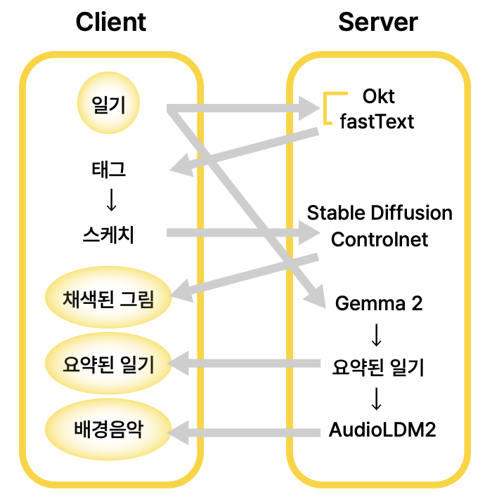
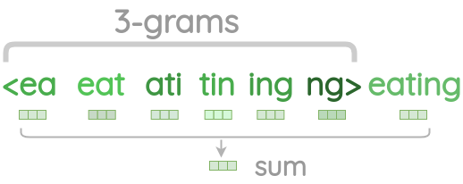
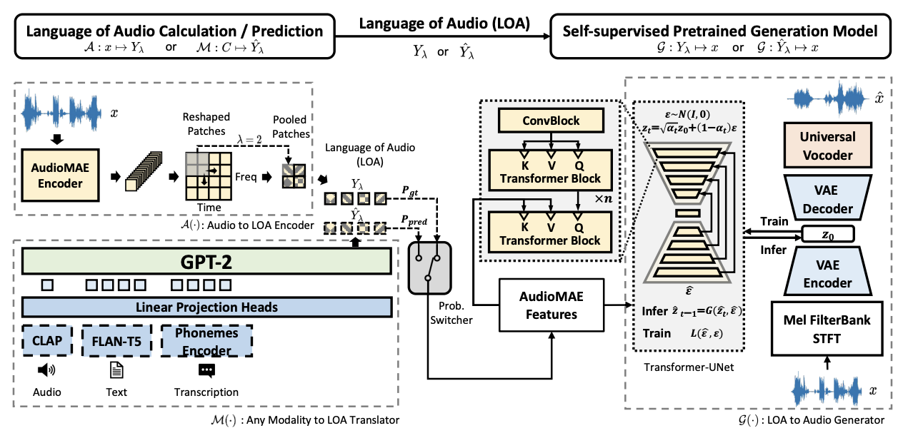
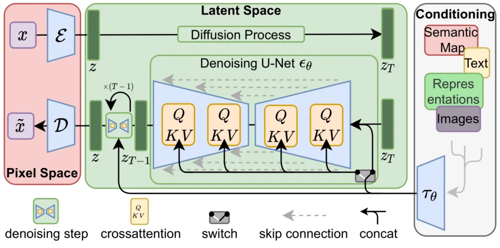
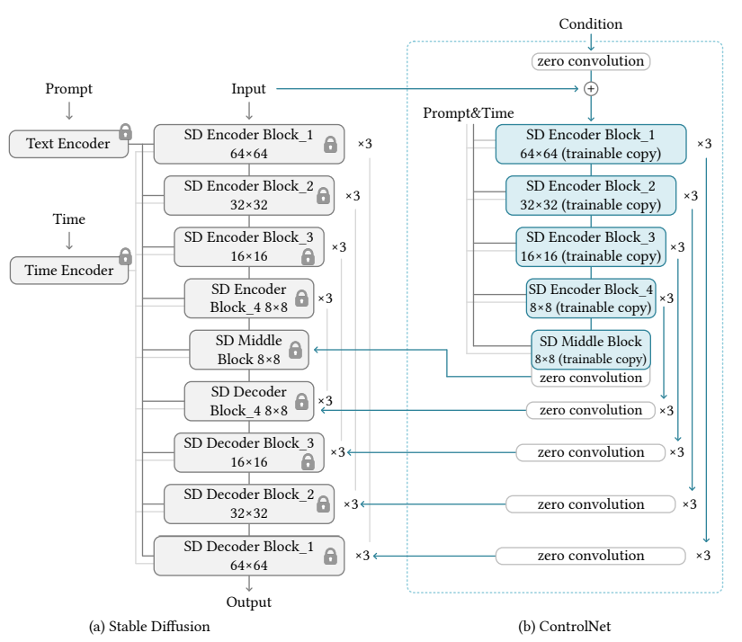
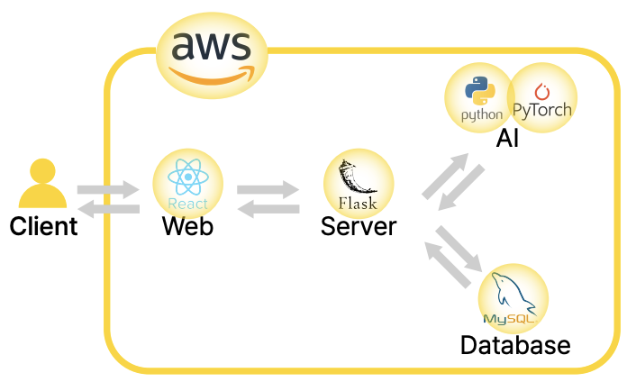

# 🎨 PICTORY: AI Drawing Diary

AI 기반의 맞춤형 그림일기 서비스, **PICTORY**입니다. <br>
하루의 감정과 이야기가 담긴 하나뿐인 그림과 음악을 만들어드립니다. <br>

오늘 하루를 그림일기로 **Chill**해보세요! ✨

---

## 🔥 주요 기능

 <br>

사용자가 일기를 작성하면, 작성된 내용을 분석하여 태그가 자동으로 생성됩니다. 태그를 클릭하면 해당 태그에 매핑된 스티커가 나오고, 이 스티커를 자유롭게 배치하고 크기를 조절하여 자신만의 스케치를 만들어 갈 수 있습니다. <br>

완성된 스케치는 이미지 디퓨전 모델에 전달되며, 모델은 이를 기반으로 그림 일기 컨셉에 맞게 부드럽고 따뜻한 파스텔톤으로 채색을 진행합니다. 또한 LLM을 통해 요약된 일기가 오디오 디퓨전 모델에 전달되어 그림과 조화를 이루는 음악을 생성하고 들려줌으로써 사용자에게 더 몰입도 높은 경험을 제공합니다. <br>

작성된 일기는 캘린더 페이지의 오른쪽 리스트에서 요약된 형태로 표시되어 전체적인 흐름을 쉽게 확인할 수 있도록 구성되었으며, 일기가 작성된 날짜는 캘린더에 표시되어 사용자가 한눈에 알아볼 수 있습니다.

---

## ⚙️ 개발환경 세팅

#### 1. 가상환경 생성

```bash
conda create -n pictory python=3.12.8
conda activate picotry
```

#### 2. 필요 라이브러리 설치

```bash
pip install -r requirements.txt
```

---

## 🚀 모델 선정 및 학습

#### 1. Okt & fastText



#### 2. Gemma 2 2B


#### 3. AudioLDM2



#### 4. Stable Diffusion v1.5 + ControlNet

<p align="left">
  
  
</p>

---

## 기술 스택

 <br>

- **AI**: `Python`, `PyTorch`
- **Frontend**: `React`
- **Backend**: `Flask`, `MySQL`

---

## 👩‍💻 팀원 및 역할

| 이름 | 역할 | 소속 |
|------|------|------|
| 김도현 | TL, AI, BE| 한양대학교 데이터사이언스학부 |
| 신우림 | FE, BE | 성신여자대학교 AI융합학부 |
| 박다영 | AI, FE | 숙명여자대학교 소프트웨어학부 |
| 강수아 | Designer | 이화여자대학교 디자인학부 |

---