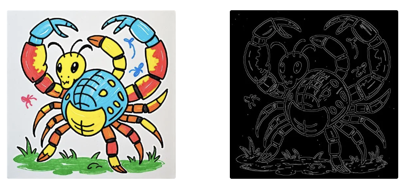

# 🎨 PICTORY: AI Drawing Diary

일상의 소중한 순간을 의미 있게 기록할 수 있도록, <br>
글뿐만 아니라 이미지와 음성을 추가할 수 있는 다이어리를 제작하였습니다. <br>

어릴 적 정성껏 완성한 그림일기를 한 장씩 펼쳐 보며 추억했던 경험을 떠올리듯, <br>
사용자의 일기를 어린아이가 파스텔로 그린 것처럼 따뜻하고 감성적으로 표현하였습니다. <br>

또한, 이를 캘린더 형식으로 모아볼 수 있도록 구성하여, <br>
시간이 지나도 동심 가득하고 생동감 넘치는 나만의 다이어리를 완성할 수 있도록 하였습니다. <br> <br>

**PICTORY**는 AI 기반의 맞춤형 그림일기 서비스입니다. <br>
하루의 감정과 이야기가 담긴 하나뿐인 그림과 음악을 만들어드립니다. <br>

오늘 하루를 그림일기로 **Chill**해보세요! ✨

---

## 🔥 주요 기능

 <br>

사용자가 일기를 작성하면, 작성된 내용을 분석하여 태그가 자동으로 생성됩니다. 태그를 클릭하면 해당 태그에 매핑된 스티커가 나오고, 이 스티커를 자유롭게 배치하고 크기를 조절하여 자신만의 스케치를 만들어 갈 수 있습니다. <br>

완성된 스케치는 이미지 디퓨전 모델에 전달되며, 모델은 이를 기반으로 그림 일기 컨셉에 맞게 부드럽고 따뜻한 파스텔톤으로 채색을 진행합니다. 또한 LLM을 통해 요약된 일기가 오디오 디퓨전 모델에 전달되어 그림과 조화를 이루는 음악을 생성하고 들려줌으로써 사용자에게 더 몰입도 높은 경험을 제공합니다. <br>

작성된 일기는 캘린더 페이지의 오른쪽 리스트에서 요약된 형태로 표시되어 전체적인 흐름을 쉽게 확인할 수 있도록 구성되었으며, 일기가 작성된 날짜는 캘린더에 표시되어 사용자가 한눈에 알아볼 수 있습니다.

---

## ⚙️ 개발환경 세팅

#### 1. 가상환경 생성

```bash
conda create -n pictory python=3.12.8
conda activate picotry
```

#### 2. 필요 라이브러리 설치

```bash
pip install -r requirements.txt
```

---

## 🎇 데모 웹사이트

```bash
cd backend
python app.py
```

---

## 🔑 데이터셋

| [Coloring & Edge Dataset](https://huggingface.co/datasets/Dohyeon1/Pictory-ControlNet-RawDataset-Crayon) | [Children Sketch Dataset](https://cybertron.cg.tu-berlin.de/eitz/projects/classifysketch/) | [Summarization & Translation Dataset](https://huggingface.co/datasets/traintogpb/aihub-flores-koen-integrated-prime-small-30k) |
|:----------------------:|:----------------------:|:----------------------:|
|  |  |  |

### 

### 

### 

---

## 🚀 모델 선정 및 학습

### Okt + fastText

 <br>

일기 내용을 기반으로 태그를 추천하기 위해서 [Okt](https://konlpy.org/ko/latest/api/konlpy.tag/#okt-class)와 [fastText](https://fasttext.cc/)를 활용였습니다. Okt를 통해 일기의 내용에서 명사만 추출한 후 저장되어 있는 태그를 매핑하여 사용자에게 제공하고, 꼭 매핑되지 않더라도 fastText를 통해서 비슷한 태그를 추천하여 사용자에게 제공해줍니다.

### Gemma 2 2B

 <br>

일기의 요약 및 번역 태스크를 수행하기 위한 LLM으로 [Gemma 2 2B](https://huggingface.co/google/gemma-2-2b-it)
을 선정하였습니다. Summarization & Translation Dataset을 활용하여 LoRA 기법으로 모델을 파인튜닝한 후 프롬프팅 기술까지 적용하여, 모델이 일기를 효과적으로 요약하고 번역할 수 있도록 하였습니다. <br>

```bash
python train/train_gemma2.py
```

### AudioLDM2

 <br>

일기의 내용에 맞는 배경음악을 생성하는 모델로 [AudioLDM2](https://huggingface.co/cvssp/audioldm2-large)을 선정하였고, 해당 모델은 텍스트 프롬프트를 입력받아 텍스트에 맞는 음악을 생성하는 구조를 가지고 있습니다. 사전 학습된 모델을 불러온 후 따로 추가적인 학습은 진행하지 않았고, 프롬프팅 기술만을 적용하였습니다.

### Stable Diffusion v1.5 + ControlNet

<p align="left">
  
  
</p>

사용자가 만들어 낸 스케치를 채색해주는 모델로 [Stable Diffusion v1.5](https://huggingface.co/stable-diffusion-v1-5/stable-diffusion-v1-5)을 선정하였고 이미지 인풋에 대한 컨디션을 조금 더 효과적으로 주기 위해서 [ControlNet](https://huggingface.co/lllyasviel/sd-controlnet-scribble)을 붙여서 사용하였습니다. Coloring & Edge Dataset을 활용하여 ControlNet 부분을 LoRA 기법으로 파인튜닝을 진행한 후 프롬프팅 기술까지 적용하여, 스케치를 그림일기의 느낌에 맞게 채색할 수 있도록 만들었습니다. <br>

```bash
python train/train_controlnet.py
```

---

## 🛠️ 기술 스택

 <br>

---

## 👩‍💻 팀원 및 역할

| 이름 | 역할 | 소속 |
|------|------|------|
| 김도현 | TL, AI, BE| 한양대학교 데이터사이언스학부 |
| 신우림 | FE, BE | 성신여자대학교 AI융합학부 |
| 박다영 | AI, FE | 숙명여자대학교 소프트웨어학부 |
| 강수아 | Designer | 이화여자대학교 디자인학부 |

---